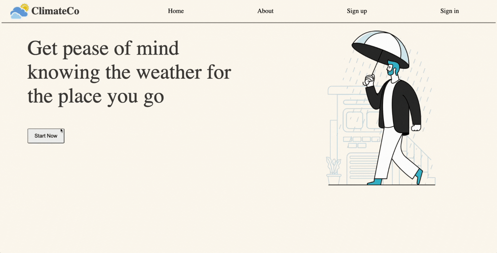

<a href="https://climateco.herokuapp.com/">
    
</a>

# :sun_behind_rain_cloud: ClimateCo
## **Introduction**
[ClimateCo](https://climateco.herokuapp.com/) gives accurate and up-to-date weather forecasts for locations around Australia.

### How it works
Choose location, get current weather and forecast for the next 7 days, and additional features available.
Our known for reliable forecasts and easy-to-use interface.

Please see more details [here](https://climateco.herokuapp.com/).

## Built with
- Ruby on Rails
- HTML
- CSS/SCSS
- Javascript
- Deployed on Heroku

### Snapshots
|Home page|
|:-:|
|  |
|User|
|  |
|Admin|
|  |

---

## :bell: Putting it all together

### :bulb: Features:

- CRUD system : 
    - the ability to log in, log out, and sign-up for users and admin.
    - show the information about the locations and cities.
    - associations between locations and cities.
- Admin pages: to add locations and cities.
- Favorites buttons that do not refresh the page and change to UnFavorite when Favorite exists.
- OpenWeather and 7timer weather API connections on the show page through gem and HTTP respectively.

### :spiral_calendar: Challenges:

1. Find the API which supports the planned details of locations.
      location controller READ part from CRUD as show function utilising OpenWeather for the data and 7timer for the images.
      
      ```ruby
          def show
            @favorite_exists = Favorite.where(location_id: @location.id, user_id: @current_user.id) == []? false : true
            @client = OpenWeather::Client.new(
              api_key: ENV['OPENWEATHER_API_KEY']
            )
            @data = @client.current_weather(zip: @location.postcode , country: 'AU')
            lon = @data.coord.lon.round(3)
            lat = @data.coord.lat.round(3)
            @weather_civil_url = "https://www.7timer.info/bin/civil.php?lon=#{ lon }&lat=#{ lat }&lang=en&ac=0&unit=metric&tzshift=0"
            @weather_civil_light_url = "https://www.7timer.info/bin/civillight.php?lon=#{ lon }&lat=#{ lat }&lang=en&ac=0&unit=metric&tzshift=0"
            @weather_two_week_url = "https://www.7timer.info/bin/two.php?lon=#{ lon }&lat=#{ lat }&lang=en&ac=0&unit=metric&tzshift=0"
          end
      ```
      
2. How to create favorite functions in this project. For favorite feature design, it was confusing on models as user have many favorite and favorite can record many location. There are also model part which was confusing as I first designed favorite to own many locations.
To summarise, I was struggle on the favorite part for a while until the solution for model, schema, and controller for favorite is like the code below:

 - Favorite schema

     ```ruby wrap
      create_table "favorites", force: :cascade do |t|
        t.bigint "location_id"
        t.bigint "user_id"
        t.datetime "created_at", null: false
        t.datetime "updated_at", null: false
        t.index ["location_id"], name: "index_favorites_on_location_id"
        t.index ["user_id"], name: "index_favorites_on_user_id"
      end
      ```

- User and favorite models

    ```ruby
    class User < ApplicationRecord
        has_many :favorites
        has_secure_password
        validates :email, :uniqueness => true, :presence => true
    end
    ```   

    ```ruby
    class Favorite < ApplicationRecord
    end
    ```  

- Favorite controller for Update part

    ```ruby
    class FavoritesController < ApplicationController
      before_action :check_for_login

      def update
        favorite = Favorite.where(location_id: Location.find(params[:location]).id, user_id: @current_user.id)
        if favorite == []
          # Create the favorite
          Favorite.create(location_id: Location.find(params[:location]).id, user_id: @current_user.id)
          @favorite_exists = true
        else
          # Delete the favorite(s)
          favorite.destroy_all
          @favorite_exists = false
        end
        respond_to do |format|
          format.html { redirect_back(fallback_location: root_path) }
          format.js {}
        end
      end
    end
    ```
         
3. How to manage class name, and id name for SCSS and reduce the repeating steps. During creation, it was hard to organise and manage the naming to be logical and efficient.

### :book: Lesson:

- Design schema is always challenging as you might miss something or put something that is never used.
- The project taught me about CRUD system, schema design, and model-view-controller (MVC).
- More understanding about session and how to write it on Ruby on Rails
     - Session controller for this project
     
         ```ruby
             class SessionController < ApplicationController
              def new
              end

              def create
                # find the user with this email address
                user = User.find_by :email => params[:email]
                if user.present? && user.authenticate(params[:password])
                # if the password matches
                  #remember this user
                  session[:user_id] = user.id
                  redirect_to root_path # IRL: send them somewhere better
                else
                  flash[:error] = "Invalid email or password"
                  # show them the login form again
                  redirect_to login_path
                end
              end

              def destroy
                session[:user_id] = nil
                redirect_to login_path
              end
            end
         ```

### :bookmark: Future updates:

- Improve the user main page by adding favorites functions after each location currently, the buttons work but switching between UnFavorite and Favorite works only on the first location on the list.
- Improve SCSS part and change naming classes in html.erb.
- Fix inferface to be more user friendly and also add responsive web design for the mobile interface.
